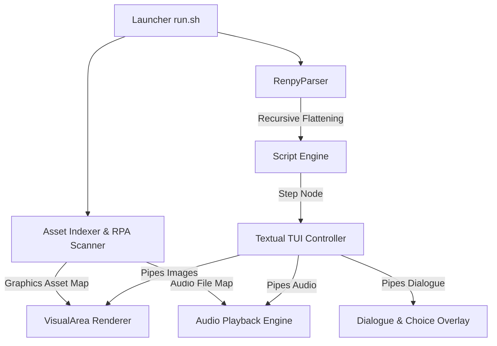

# ◈ Ren'Py Terminal Player ◈

A premium, feature-rich Terminal User Interface (TUI) player for Ren'Py visual novels. Play your favorite visual novels directly in your terminal with high-resolution graphics, immersive background audio, and fully managed game states.

---

## ✨ Features

- 🖼️ **Dual Graphic Modes**: 
  - **Sixel Graphics Protocol**: Ultra-fast, zero-overhead high-resolution rendering designed for Kitty, WezTerm, Konsole, etc.
  - **ANSI Half-Block Unicode**: Dynamic pixelated fallback rendering for standard terminals.
- 🔊 **Full Immersive Audio**:
  - Looping background music, sound effects, and voice lines.
  - Extracts audio tracks on-the-fly directly from `.rpa` archives.
  - Silenced SFX/voices during fast-skip mode to conserve system resources.
- 💾 **Robust State Management**:
  - 5-slot Save/Load system capturing dialogue history, speakers, timestamps, and the currently playing audio track.
- ⏩ **Fast Skip Mode**:
  - Toggle skip state via `Tab` / `Ctrl+F` to speed through text.
- 🧩 **RPA & RPYC Decompiler Integrations**:
  - Automated extraction of script archives and on-the-fly decompilation of bytecode (`.rpyc`) into source files (`.rpy`).
- 🧭 **Precise Flow Control**:
  - Advanced flattening algorithm to recursively parse nested choice menus.
  - Strict file-boundary fallthrough protection preventing story skipping.

---

## 🛠️ Requirements

- **Linux** (Tested on Ubuntu/Debian/Arch)
- **Python 3.10+**
- **mpv** (for background audio playback)
  ```bash
  sudo apt install mpv  # Ubuntu/Debian
  sudo pacman -S mpv    # Arch Linux
  ```

---

## 🚀 Quick Start

1. Clone or download this repository.
2. Run the launcher script pointing to your Ren'Py game folder:
   ```bash
   ./run.sh /path/to/your/renpy_game_folder
   ```

*On the first run, the player will scan, extract, and decompile bytecode script archives, then load you directly into the terminal novel experience!*

---

## 🎮 Keybindings

| Key | Action |
| --- | --- |
| `Space` / `Right Arrow` | Advance Dialogue / Text |
| `Tab` / `Ctrl+F` | Toggle Fast Skip Mode |
| `S` | Open Save Menu |
| `L` | Open Load Menu |
| `V` | Cycle Graphics Mode (High-Res Sixel vs. ANSI Pixelated) |
| `Esc` | Close Save/Load/Choice overlay menus |
| `R` | Restart Story from the beginning |
| `Q` | Quit Player |

---

## 🏗️ Architecture



---

## ⚖️ License

MIT License. Designed with 💜 by Antigravity.
